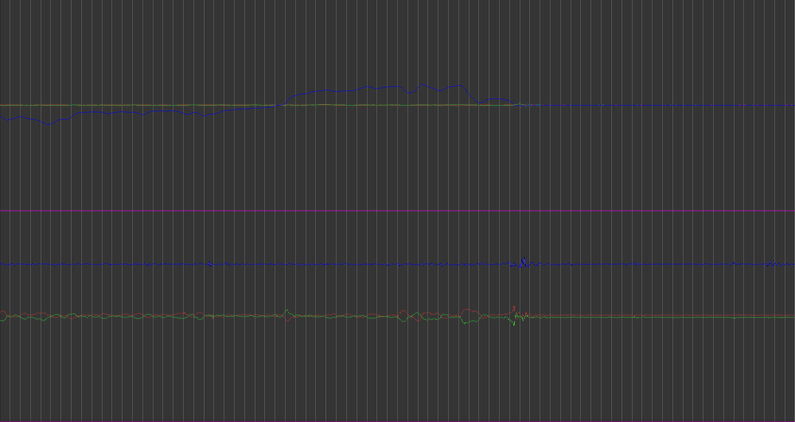
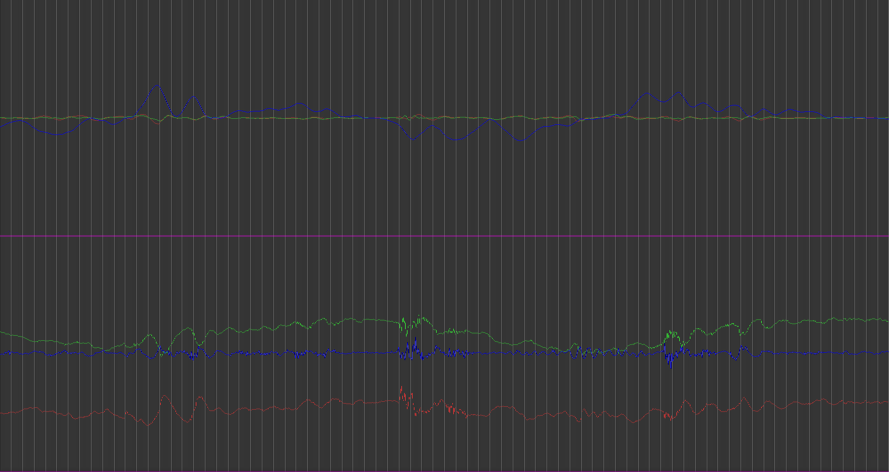
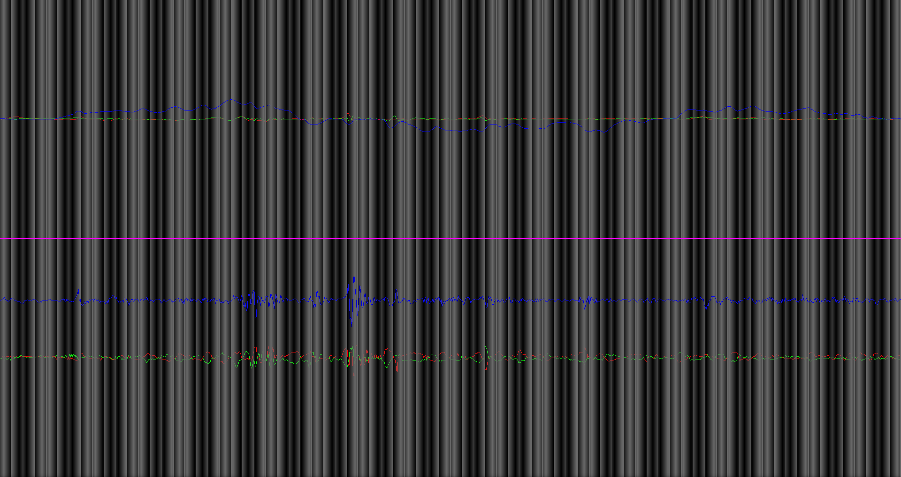
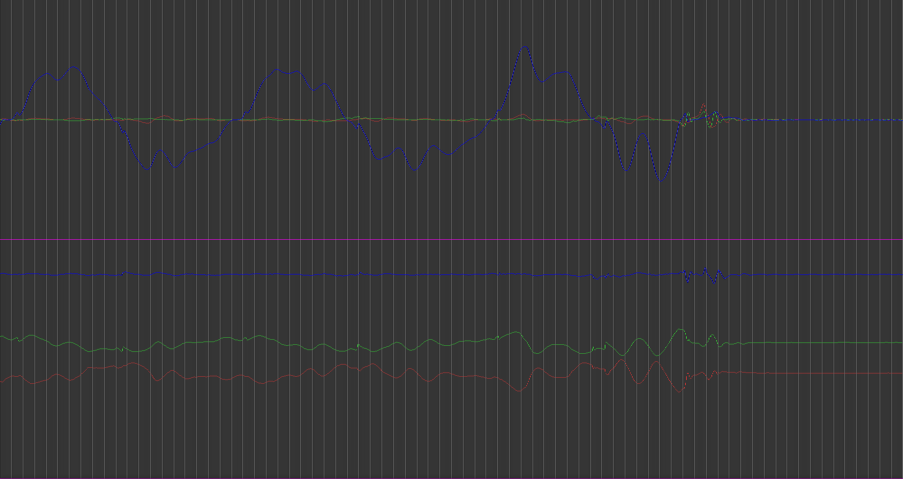
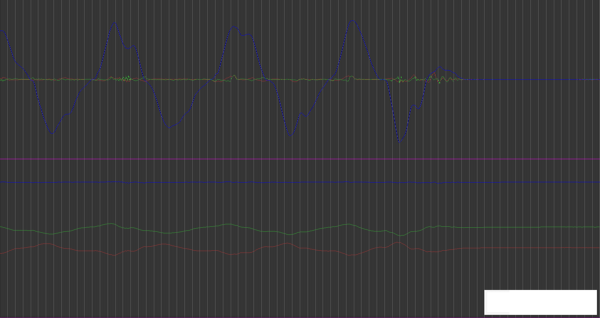

---
---

Here i'm working on a stabilization system using a Stm32F3Disovery.

Here you can take a look at raw data coming from the board.
upper graph is gyroscope, with a range of +-500°/s
lower is acceleromenter, with a range of 2G
the with of the graph is about 4 seconds. (all point coming from sensors are displyed, and their ODR is sett be 400Hz)

as you can see there is a lot of noise onthe acceleromenter; so i decided to try to average the last 5 reading (please note acceleromenter zero hasn't been calibrated in those graph):

then with the last 10 reading:

andfinally as a check with the last 50 reading:
